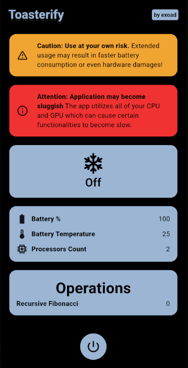

<h1 align="center">Toasterify</h1>

<strong>
Need a hand warmer? Toasterify warms up your phone!
</strong>

> **Note**: This was just a simple stupid project I made and doesn't really serve a purpose except to warm up your phone.

**If you would like add your own taxing algorithm, you can simply do so by implementing the `ComputableModel` used!**
